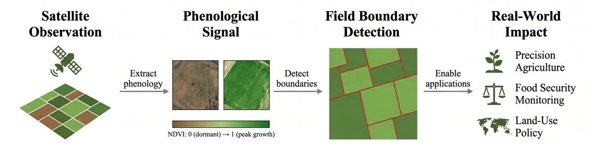

# Cross-Geography Agricultural Field Boundary Segmentation via Temporally-Aware Dataset Harmonization



Official code for our PRICAI 2026 paper. We propose a dataset harmonization framework that bridges the Fields of the World (FTW) and PASTIS benchmarks through NDVI-guided temporal compression and a Temporal Contrast Boundary Module (TCBM), achieving improved cross-geography generalization for agricultural field boundary segmentation. We propose a dataset harmonization framework that bridges the Fields of the World (FTW) and PASTIS benchmarks through NDVI-guided temporal compression and a Temporal Contrast Boundary Module (TCBM), achieving improved cross-geography generalization for agricultural field boundary segmentation.

## Key Results

| Model | Data | mIoU | Field IoU | Boundary F1 |
|---|---|---|---|---|
| U-Net (Official) | FTW | 0.411 | 0.367 | 0.419 |
| SegFormer | FTW | 0.314 | 0.356 | 0.337 |
| TA-UNet | FTW+PASTIS | 0.329 | 0.385 | 0.343 |
| **TCBM-UNet (ours)** | FTW+PASTIS | **0.340** | **0.392** | 0.344 |

Results on the FTW held-out test split (Vietnam + Cambodia).

## Repository Structure

```
src/            Core implementation (datasets, models, training, evaluation)
scripts/        Utility scripts (diagnostics, visualization, data exploration)
results/        Experiment results and qualitative figures
figures/        Paper figures
checkpoints/    Trained model weights (see checkpoints/README.md)
```

## Setup

```bash
conda create -n seg python=3.10
conda activate seg
pip install -r requirements.txt
```

## Data

This repository does NOT include the FTW or PASTIS datasets due to size and licensing. Download them from:
- FTW: [Fields of the World GitHub](https://github.com/fieldsoftheworld/ftw-baselines)
- PASTIS: [PASTIS dataset page](https://github.com/VSainteuf/pastis-benchmark)

Place downloaded data under `data/ftw/` and `data/pastis/` respectively, then run preprocessing:

```bash
python src/pastis_temporal_reduction.py --temporal_strategy ndvi_minmax
python src/pastis_preprocess.py
```

## Training

```bash
python src/train.py --model tcbm_unet --data combined --epochs 20
```

## Evaluation

```bash
python src/evaluate.py --model_path checkpoints/tcbm_unet_combined_20260614_002528/best_model.pth --split test
```

## Citation

If you use this code, please cite:

```bibtex
@inproceedings{[citation_key]2026,
  title={Phenological Contrast: A Geography-Agnostic Prior for Cross-Geography Field Boundary Segmentation},
  author={Ghulam Arbi, 	Naveed Ur Rehman Junejo, Abid Hussain
Corresponding Author},
  booktitle={IEEE Journal of Selected Topics in Applied Earth Observations and Remote Sensing },
  year={2026}
}
```

## License

This project is licensed under the MIT License - see the [LICENSE](LICENSE) file for details.
